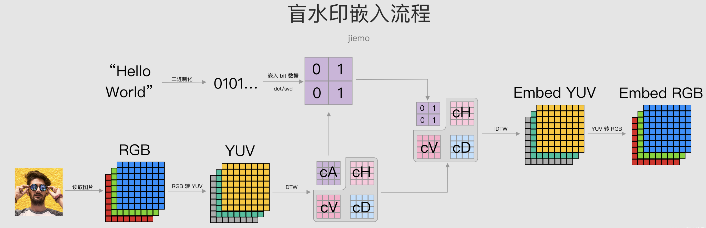
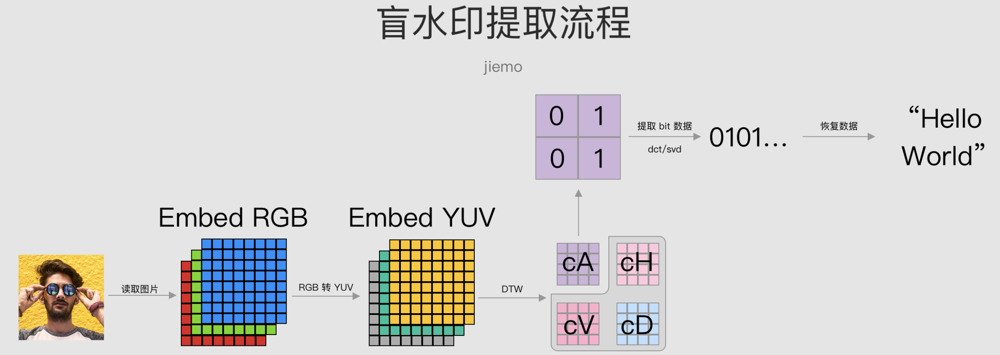

# Blind Watermark: 数字盲水印技术实践

本项目演示了如何使用 Python 的 `blind-watermark` 库为图片嵌入肉眼不可见的数字水印，并测试其在多种常见图像攻击下的鲁棒性。

## 1. 简介

**数字盲水印**（Blind Watermark）是一种先进的版权保护技术。它将特定的信息（如文本或标识）以不可见的形式嵌入到数字媒体（如图像、视频）中，不会对原始图像的质量产生很大影响。

与传统水印不同，它的“盲”体现在**提取水印时不需要原始的未嵌入水印的媒体文件**，仅凭含有水印的文件即可恢复隐藏信息。这使得它在版权追溯、内容认证和防伪等领域具有极高的实用价值。

盲水印算法的基本原理是将数字水印嵌入到数字媒体的频域或空域中，使得数字水印能够在不影响原始媒体质量的情况下被提取出来。盲水印算法通常包括两个主要步骤：嵌入和提取。

*   **嵌入阶段**：将数字水印转换为频域或空域信号，并将其嵌入到数字媒体中。嵌入过程需要考虑数字水印的鲁棒性和不可见性。
*   **提取阶段**：对数字媒体进行处理以提取数字水印。提取过程需要考虑数字水印的鲁棒性和准确性。

盲水印算法在数字版权保护、数字身份认证和数字隐私保护等领域具有广泛的应用。它可以帮助数字内容提供商保护其版权，防止盗版和侵权行为；也可以帮助用户保护其数字身份和隐私，防止个人信息被泄露。

## 2. 算法流程

本章分析 `blind-watermark` 库中的核心算法逻辑。

### 2.1 水印嵌入

整体流程如下图，接下来对各个阶段做详细的解释。



#### 2.1.1 水印二进制化

水印可以是各种形式的信息，包括字符串、图片等。为了嵌入这些信息，我们首先需要将水印转换为二进制形式，即由0和1组成的数组。例如，我们可以将字符串转换为二进制数组。

```python
byte = bin(int(wm_content.encode('utf-8').hex(), base=16))[2:]
self.wm_bit = (np.array(list(byte)) == '1')
```

在上面的代码中，首先将字符串类型的水印信息 `wm_content` 转换为十六进制格式，然后使用 `int()` 函数将其转换为整数。接着，使用 `bin()` 函数将整数转换为二进制格式，并去掉前缀 ‘0b’，得到一个字符串类型的二进制数。最后，使用 `np.array()` 函数将字符串转换为一个由 ‘0’ 和 ‘1’ 组成的数组，并将其与 ‘1’ 做比较，得到一个布尔类型的数组 `self.wm_bit`，其中 True 表示对应位置为 ‘1’，False 表示对应位置为 ‘0’。

#### 2.1.2 图像预处理

读取图片后，我们进行图像预处理，包括：
*   如果图片包含 Alpha 通道，那么忽略它，只保留 RGB 颜色通道。
*   如果图片的大小不是偶数的，那么对图片进行填充，使其大小为偶数。做这一步是因为后续需要对图片进行分块处理，块大小是 4x4，如果图片大小不是偶数的话，处理起来比较麻烦。
*   将 RGB 转换为 YUV444 格式。

#### 2.1.3 YUV 数据进行小波变换（DWT）

得到 YUV 数据后，接着对各通道进行二维离散小波变换（DWT）。

```python
for channel in range(3):
   self.ca[channel], self.hvd[channel] = dwt2(self.img_YUV[:, :, channel], 'haar')
```

对于小波变换，具体原理我们暂时不进行深究，只需要了解：
*   在二维离散小波变换中，将图像分解为四个子图像，分别表示原图像的近似部分（Approximation，简称 cA）和水平（Horizontal，简称 cH）、垂直（Vertical，简称 cV）以及对角线（Diagonal，简称 cD）方向的细节部分。具体地，cA 表示原图像的低频部分，即近似部分，包含了图像的大部分能量；cH、cV 和 cD 分别表示原图像在水平、垂直和对角线方向上的高频部分，包含了图像的细节信息。
*   如果输入图像为 M x N，那么四个子图像大小为 M/2 * N/2。
*   通过二维离散小波逆变换，可以将四个子图像恢复为原来图像。

#### 2.1.4 在 cA 图像中分块嵌入数据

YUV 通道进行小波变换后得到 cA 子图像，接着对 cA 矩阵进行分块处理（block），块大小为 4x4。对于每个 block，我们嵌入一个 bit 的信息。在 `blind_watermark` 中，通过对 block 进行离散余弦变换（DCT）和奇异值分解（SVD），修改其奇异值来嵌入水印比特位。

以 `block_add_wm_fast` 方法为例，其逻辑为：
1.  对 4x4 的 block 进行 DCT。
2.  对 DCT 输出矩阵进行 SVD，得到奇异值 `s`。
3.  通过 `s[0] = (s[0] // self.d1 + 1 / 4 + 1 / 2 * wm_1) * self.d1` 将 1-bit 数据（`wm_1`）嵌入到第一个奇异值中。
4.  通过逆 SVD 和逆 DCT 恢复 block。

重复上述过程，将每一个 bit 都嵌入到对应 block 中，则完成了数据嵌入。根据这个逻辑，一张 `H x W` 的图片最多能够嵌入 `(H * W) / 64` 个 bit 的数据。

#### 2.1.5 恢复为 RGB 数据

在 cA 矩阵上嵌入数据后，通过逆小波变换（IDWT）转换为 YUV 数据，接着 YUV 数据可以转为 RGB 以便保存为图片文件。

```python
for channel in range(3):
	embed_YUV[channel] = idwt2(embed_ca[channel], hvd[channel])

embed_img = yuv2rgb(embed_YUV)
```

#### 2.1.6 乱序（可选）

`blind-watermark` 中的 `password` 参数用于设置一个随机种子，以便在嵌入过程中打乱嵌入数据的顺序，增强水印的安全性。

### 2.2 水印提取

水印的提取过程是嵌入的逆过程。整体流程如下图：



#### 2.2.1 图片数据预处理

与嵌入流程类似，读取图片进行预处理：RGB 转 YUV，再对 YUV 数据进行二维小波变换，得到 cA 子图像。

#### 2.2.2 在 cA 图像分块中提取数据

对 cA 矩阵进行分块（4x4），提取每个 block 中的 bit 信息。提取算法为嵌入的逆过程，即通过 DCT 和 SVD 分解，根据第一个奇异值 `s[0]` 来判断 bit 是 0 还是 1：`wm = (s[0] % self.d1 > self.d1 / 2) * 1`。

#### 2.2.3 取平均

在嵌入过程中，数据是冗余嵌入的（YUV 三个通道重复嵌入，短水印也会循环嵌入）。这种冗余性可以增强盲水印的抗攻击能力。因此，在提取数据时，可以对提取到的比特流进行分组平均，以获取更准确的原始数据。

#### 2.2.4 K-Means 聚类

取平均后得到的是一个浮点数组。为了完全恢复为 0 和 1，`blind_watermark` 使用 K-Means 算法进行二分类，将浮点值聚类为最终的 0/1 比特流。

## 3. 注意事项与限制

### 3.1 关于水印长度的问题

在提取水印时，需要知道原始水印的长度，以便对提取出的比特流正确地进行平均和解码。这就带来一个问题：在提取水印时，你无法知道该图片水印的长度。

一个可行的解决方案是**固定水印长度**，例如约定所有水印都是 64 bit。如果实际水印不足 64 bit，则用 0 填充；如果超过，则无法嵌入。

### 3.2 关于抗攻击的说明

`blind-watermark` 展示了其抗多种攻击的能力，但这里的测试是有前提的：**无论做了哪种攻击，在提取水印前你需要将图片尽可能恢复到原始状态**。例如：
*   **缩放攻击**：假设图片从 512x512 缩放到 256x256，那么首先需要将图片恢复至 512x512，再送去提取。
*   **截屏攻击**：从 (x, y) 点截取 200x200 的图片，你不能直接用这 200x200 的数据提取，而是要创建一个与原图大小一致的空白图像，将截取的 200x200 数据填充回 (x, y) 位置，再进行提取。

之所以有这种要求，是因为算法在嵌入和提取的过程中，隐式地依赖了图像块（block）的位置信息。在实际应用中，要满足这些恢复条件可能比较困难，因为你无法预知用户会对图片做什么样的操作。这也是盲水印算法在应用中的一个局限和难点。

## 4. `blind-watermark` 库基本用法

本节提供 `blind-watermark` 库的详细用法和代码示例。

### 4.1 嵌入二进制数据 (`mode='bit'`)

下面的代码会读取图片并加入二进制数据盲水印。

**嵌入与提取**
```python
import blind_watermark
import numpy as np
import cv2

# 关闭内置的消息输出
blind_watermark.bw_notes.close()
from blind_watermark import WaterMark

# 初始化
bwm = WaterMark(password_img=1, password_wm=1)
img_path = 'input/input.png'
output_path = 'output/embedded_bit.png'
bwm.read_img(img_path)

# 定义要嵌入的二进制数据
wm = [True, False, True, False, True, False, True, False, True, False]
bwm.read_wm(wm, mode='bit')

# 嵌入水印
bwm.embed(output_path)

# 提取水印
len_wm = len(wm)
bwm1 = WaterMark(password_img=1, password_wm=1)
wm_extract = bwm1.extract(output_path, wm_shape=len_wm, mode='bit')
print("不攻击的提取结果：", wm_extract)

assert np.all(wm == wm_extract), '提取水印和原水印不一致'
```

**攻击测试示例**

```python
from blind_watermark import att
from PIL import Image

ori_img_shape = cv2.imread(img_path).shape[:2]

# 1. 截图攻击
loc = ((0.3, 0.1), (0.7, 0.9))
attack_path = 'output/attack_cut.png'
att.cut_att(input_filename=output_path, output_file_name=attack_path, loc=loc)
wm_extract = bwm1.extract(attack_path, wm_shape=len_wm, mode='bit')
print(f"截屏攻击 {loc} 后的提取结果：", wm_extract)

# 2. 遮挡攻击
attack_path = 'output/attack_shelter_demo.png'
att.shelter_att(input_filename=output_path, output_file_name=attack_path, ratio=0.1, n=60)
wm_extract = bwm1.extract(attack_path, wm_shape=len_wm, mode='bit')
print(f"遮挡攻击后的提取结果：", wm_extract)

# 3. 旋转攻击
attack_path = 'output/attack_rot.png'
recover_path = 'output/attack_rot_recover.png'
att.rot_att(input_filename=output_path, output_file_name=attack_path, angle=45)
att.rot_att(input_filename=attack_path, output_file_name=recover_path, angle=-45) # 旋转回来
wm_extract = bwm1.extract(recover_path, wm_shape=len_wm, mode='bit')
print("旋转攻击后的提取结果：", wm_extract)
```

### 4.2 嵌入图片数据 (`mode='img'`)

下面的代码会读取图片并加入另一张图片作为水印。注意，水印图片会丢失色彩信息。

```python
import cv2
from blind_watermark import WaterMark

bwm = WaterMark(password_wm=1, password_img=1)
bwm.read_img('input/input.png')

# 读取水印图片
watermark_path = 'input/watermark.png' # 假设有一个水印图片
bwm.read_wm(watermark_path, mode='img')

# 嵌入
output_path = 'output/embedded_img.png'
bwm.embed(output_path)

# 提取
wm_shape = cv2.imread(watermark_path, flags=cv2.IMREAD_GRAYSCALE).shape
bwm1 = WaterMark(password_wm=1, password_img=1)
bwm1.extract(output_path, wm_shape=wm_shape, out_wm_name='output/extracted_wm.png', mode='img')
```

### 4.3 嵌入文本数据 (`mode='str'`)

这是最常见的添加水印方式。

**嵌入与提取**
```python
bwm = WaterMark(password_img=1, password_wm=1)
bwm.read_img('input/input.png')

wm = 'hello 世界！'
bwm.read_wm(wm, mode='str')

output_path = 'output/embedded_str.png'
bwm.embed(output_path)

len_wm = len(bwm.wm_bit)
print(f'水印比特长度: {len_wm}')

# 提取
bwm1 = WaterMark(password_img=1, password_wm=1)
wm_extract = bwm1.extract(output_path, wm_shape=len_wm, mode='str')
print("不攻击的提取结果：", wm_extract)
assert wm == wm_extract, '提取水印和原水印不一致'
```

**攻击测试示例**
```python
# 1. 椒盐攻击
attack_path = 'output/attack_salt_pepper.png'
att.salt_pepper_att(input_filename=output_path, output_file_name=attack_path, ratio=0.02)
wm_extract = bwm1.extract(attack_path, wm_shape=len_wm, mode='str')
print(f"椒盐攻击后的提取结果：", wm_extract)

# 2. 纵向裁剪攻击
attack_path = 'output/attack_cut_height.png'
recover_path = 'output/attack_cut_height_recover.png'
att.cut_att_height(input_filename=output_path, output_file_name=attack_path, ratio=0.4)
att.anti_cut_att(input_filename=attack_path, output_file_name=recover_path, origin_shape=ori_img_shape) # 填充恢复
wm_extract = bwm1.extract(recover_path, wm_shape=len_wm, mode='str')
print(f"纵向裁剪攻击后的提取结果：", wm_extract)
```

## 5. 环境安装

确保已安装 Python 环境，然后在命令行中执行以下命令来安装所需库：

```shell
pip install "blind-watermark[all]" opencv-python numpy
```

## 6. 本项目使用方法

以下代码展示了本项目如何封装水印嵌入与测试。

### 核心代码 (`bw.py`)

项目中的 `bw.py` 脚本被重构为一个面向对象的测试套件 `WatermarkAttackSuite`，它封装了水印嵌入、攻击模拟和结果验证的全过程。

```python
import os
import cv2
import numpy as np
from blind_watermark import WaterMark, att
from blind_watermark.recover import estimate_crop_parameters, recover_crop

# --- 全局配置 ---
CONFIG = {
    'input_image': 'input/input.png',
    'output_dir': 'output',
    'embedded_image_name': 'embedded.png',
    'watermark_text': 'DingHaa',
    'password_img': 1,
    'password_wm': 1,
    'attacks': {
        'screenshot_known': {'loc_r': ((0.1, 0.1), (0.5, 0.5)), 'scale': 0.7},
        'screenshot_unknown': {'loc_r': ((0.1, 0.1), (0.7, 0.6)), 'scale': 0.7},
        'rotation': {'angle': 60},
        'shelter': {'ratio': 0.1, 'n': 60},
        'resize': {'out_shape': (400, 300)},
        'brightness': {'ratio': 0.9},
    }
}

class WatermarkAttackSuite:
    # ... (此处省略了类的具体实现, 详见 bw.py) ...
    # 该类包含了初始化、环境准备、执行各类攻击测试和验证水印的方法。
    pass

def main():
    """
    主函数，用于实例化并运行整个测试套件。
    """
    suite = WatermarkAttackSuite(config=CONFIG)
    suite.run()

if __name__ == '__main__':
    main()
```

### 运行脚本

直接在终端中运行 `bw.py`：

```shell
python bw.py
```

脚本会自动完成以下操作：
1.  读取 `input/input.png` 图像。
2.  将水印文本 `'DingHaa'` 嵌入图像，并保存到 `output/embedded.png`。
3.  模拟多种攻击（如亮度调整、旋转、缩放、遮挡、截图等），生成受攻击的图像。
4.  尝试从受攻击的图像中提取水印，并验证其正确性。

## 7. 本项目攻击鲁棒性测试结果

该脚本测试了以下攻击类型，并成功提取了原始水印，证明了该技术的鲁棒性。

| 攻击方式 | 攻击后图片示例 | 提取的水印 |
| :--- | :---: | :---: |
| **无攻击** |  | `'DingHaa'` |
| **亮度攻击** |  | `'DingHaa'` |
| **缩放攻击** |  | `'DingHaa'` |
| **旋转攻击** |  | `'DingHaa'` |
| **遮挡攻击** |  | `'DingHaa'` |
| **截图攻击(参数已知)** | | `'DingHaa'` |
| **截图攻击(参数未知)** | | `'DingHaa'` |
