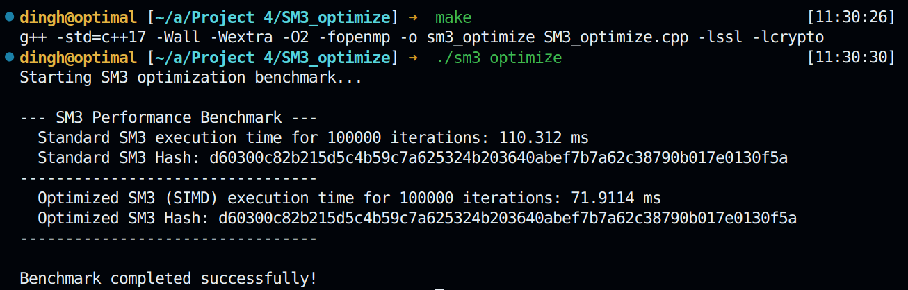

# SM3算法套件

本项目集成了SM3哈希和Merkle树的多种应用：碰撞攻击、长度扩展攻击、性能优化，以及数据完整性验证。各模块重点保留“原理与思路”细节，其余简洁概述。

### 1. Birthday Attack (SM3_BirthdayAttack)
- **核心逻辑**：基于生日悖论，期望碰撞次数≈2^(n/2)。
- **流程**：随机消息→SM3哈希→截断前n位作键→查哈希表→碰撞则终止。
- **数据结构**：`unordered_map<uint32_t,string>`，O(1)平均查插。
- **要点**：OpenSSL EVP接口；移动语义；高精度计时。

### 2. Rho Method (SM3_rho_method)
- **核心逻辑**：Floyd判圈算法，慢指针步长1，快指针步长2，首次相遇即检测循环。
- **流程**：构建哈希链→检测环→双指针同步定位碰撞。
- **优化**：倍增迭代与Brent改进可进一步提速。

### 3. Length Extension (SM3_LengthExtensionAttack)
- **核心逻辑**：利用Merkle–Damgård结构，将已知哈希作为IV，恢复填充，追加数据继续压缩。
- **流程**：恢复内部状态→sm3_update追加数据→输出扩展哈希。

### 4. Performance Optimize (SM3_optimize)
- **核心逻辑**：结合SIMD并行与编译器优化，加速SM3计算。
- **流程**：基准串行实现→AVX2寄存器并行处理8×32位→`-O2 -march=native -fopenmp`多线程支持。

### 5. Merkle Tree (Merkle_Tree)
- **核心逻辑**：自底向上构建哈希树；叶子为数据哈希，非叶子为子哈希拼接再哈希。
- **动态插入**：重建全树；可扩展为增量更新。
- **包含证明**：收集兄弟节点哈希序列→逐层重算验证根哈希。

---
各模块均提供`Makefile`，一键编译与运行。例如：
```
cd SM3_BirthdayAttack && make && make run
cd SM3_rho_method      && make && make run
cd SM3_LengthExtensionAttack && make && make run
cd SM3_optimize        && make && make run
cd Merkle_Tree         && make && make run
```
更多细节请查看各子目录下的`README.md`或源文件。

### 项目背景

#### SM3哈希函数简介

SM3是中国国家密码管理局发布的密码行业标准，是一种密码杂凑算法。SM3算法的输出长度为256位，被广泛应用于数字签名、消息认证码生成、随机数生成等密码学应用中。SM3算法具有以下特点：

- **输出长度**：256位（32字节）
- **分组长度**：512位
- **安全强度**：设计目标为128位安全强度
- **应用场景**：数字证书、SSL/TLS协议、区块链等

#### 生日攻击背景

生日攻击是密码学中一种重要的攻击方法，其名称来源于著名的"生日悖论"。在密码学安全性分析中，生日攻击用于评估哈希函数的抗碰撞能力，是衡量哈希函数安全性的重要指标。

**攻击意义**：
- 验证哈希函数的理论安全边界
- 评估截断哈希值的安全性
- 为密码系统设计提供安全性参考

### 详细技术原理

#### 生日悖论数学基础

生日悖论指出：在一个有23个人的房间里，至少有两个人生日相同的概率超过50%。这个看似反直觉的结果源于组合数学原理。

**数学公式推导**：

对于n位哈希输出：
- 总可能输出数：N = 2^n
- 找到碰撞的期望尝试次数：E ≈ √(πN/2) ≈ 2^(n/2)
- 成功概率为50%时的尝试次数：k ≈ 1.177 × √N

**具体到本项目**：
- 攻击目标：24位哈希输出
- 总可能性：N = 2^24 = 16,777,216
- 理论期望尝试次数：√(π × 16,777,216 / 2) ≈ 5,133
- 50%成功概率：约4,096次尝试

#### SM3算法特性分析

SM3算法采用Merkle-Damgård结构，具有以下密码学特性：

1. **单向性**：给定哈希值，计算原像在计算上不可行
2. **抗弱碰撞性**：给定消息，找到具有相同哈希值的另一消息困难
3. **抗强碰撞性**：找到任意两个具有相同哈希值的消息困难

**安全性边界**：
- 对于完整256位输出：需要2^128次操作找到碰撞
- 对于截断输出：安全性线性下降

#### 攻击策略设计

**时间-空间权衡**：
- 时间复杂度：O(2^(n/2))
- 空间复杂度：O(2^(n/2))
- 实际实现中通过哈希表优化查找效率

**随机性要求**：
- 使用密码学安全的随机数生成器
- 确保输入数据的均匀分布
- 避免生成数据的可预测性

### 代码设计思路

#### 实现思路

##### 生日攻击原理详解

举个例子：当老师问一个有30名学生的班级（n = 30）每个人的生日在哪一天（为简便，此处省略闰年）以确定是否有两个学生同一天生日（对应碰撞）。从直觉角度考虑，几率看起来很小。若老师选择特定日期（例如9月16日），则至少有一名学生在那天出生的概率是：

1−(364/365)^30，约为7.9%

但是，与我们的直觉相反的是，至少一名学生和另外任意一名学生有着相同生日的概率大约为70.63%（n = 30时）。

这个例子完美诠释了生日攻击的核心思想：**寻找任意碰撞比寻找特定目标容易得多**。

##### 算法实现策略

定义一字典 D，其键值表示某一消息的哈希值，内容是原始消息。依次对不同消息计算哈希值，然后判断哈希值在字典中是否已经存在，若存在，则输出当前消息以及字典中的哈希值所对应的消息，否则将该哈希值与消息本身存入字典中，继续计算。该算法的时间复杂度和空间复杂度均为 $O(2^{\frac{n}{2}})$。

**算法伪代码**：
```
Algorithm: Birthday Attack on Hash Function
Input: Hash function H, target collision bits n
Output: Two messages m1, m2 such that H(m1)[0:n] = H(m2)[0:n]

1. Initialize empty hash table D
2. counter = 0
3. WHILE counter < MAX_ITERATIONS:
4.    Generate random message m
5.    Compute h = H(m)
6.    Extract key = h[0:n/8]  // 取前n位作为键
7.    IF key EXISTS in D:
8.       OUTPUT "Collision found!"
9.       OUTPUT "Message 1:", D[key]
10.      OUTPUT "Message 2:", m
11.      RETURN SUCCESS
12.   ELSE:
13.      D[key] = m
14.   counter++
15. RETURN FAILURE
```

##### 数据结构选择分析

**哈希表的优势**：
- **查找效率**：O(1)平均时间复杂度
- **插入效率**：O(1)平均时间复杂度
- **空间效率**：仅存储实际遇到的哈希值

**键值设计**：
```cpp
// 将24位哈希截断转换为64位整数键
uint64_t extract_key(const uint8_t hash[]) const {
    uint64_t key = 0;
    std::memcpy(&key, hash, COLLISION_BYTE);  // COLLISION_BYTE = 3
    return key;
}
```

**内存布局优化**：
- 使用`std::unordered_map<uint64_t, std::vector<uint8_t>>`
- 键：64位整数，包含24位有效哈希位
- 值：32字节原始消息，使用vector自动管理内存

#### 整体架构设计

**面向对象设计原则**：
```cpp
class SM3BirthdayAttack {
private:
    // 核心参数配置
    static const int COLLISION_LEN = 24;        // 攻击位长度
    static const int COLLISION_BYTE = 3;        // 字节长度
    static const uint64_t MAX_ITERATIONS = 429496; // 最大迭代次数
    
    // 数据存储结构
    std::unordered_map<uint64_t, std::vector<uint8_t>> hash_map;
};
```

**设计考虑**：
1. **封装性**：将攻击逻辑封装在类中，隐藏实现细节
2. **可配置性**：通过常量定义关键参数，便于调整
3. **类型安全**：使用强类型，避免类型转换错误
4. **资源管理**：使用RAII原则管理内存资源

#### 核心算法实现

**1. 随机数据生成策略**
```cpp
std::vector<uint8_t> generate_random_data() const {
    std::vector<uint8_t> data(32);
    RAND_bytes(data.data(), 32);  // 使用OpenSSL加密安全随机数
    return data;
}
```

**设计要点**：
- 使用OpenSSL的RAND_bytes确保随机性质量
- 32字节输入长度提供足够的输入空间
- 返回值优化减少不必要的拷贝

**2. 哈希计算与键提取**
```cpp
std::vector<uint8_t> compute_sm3_hash(const std::vector<uint8_t>& data) const {
    std::vector<uint8_t> hash(32);
    EVP_Digest(data.data(), data.size(), hash.data(), &hash_len, EVP_sm3(), nullptr);
    return hash;
}

uint64_t extract_key(const uint8_t hash[]) const {
    uint64_t key = 0;
    std::memcpy(&key, hash, COLLISION_BYTE);  // 提取前24位作为键
    return key;
}
```

**技术细节**：
- 使用OpenSSL EVP接口保证算法正确性
- 字节序处理确保跨平台兼容性
- 内存安全的数据拷贝操作

**3. 碰撞检测算法**
```cpp
bool find_collision() {
    for (uint64_t i = 0; i < MAX_ITERATIONS; i++) {
        auto data = generate_random_data();
        auto hash = compute_sm3_hash(data);
        uint64_t key = extract_key(hash.data());
        
        auto it = hash_map.find(key);
        if (it != hash_map.end()) {
            // 发现碰撞
            display_collision_result(it->second, data, key);
            return true;
        }
        
        hash_map[key] = std::move(data);  // 移动语义优化
    }
    return false;
}
```

**算法优化**：
- 使用std::unordered_map实现O(1)平均查找时间
- 移动语义减少数据拷贝开销
- 早期退出策略提高效率

#### 内存管理策略

**现代C++内存管理**：
1. **智能指针替代原始指针**：避免内存泄漏
2. **容器自动管理**：std::vector自动处理内存分配和释放
3. **移动语义**：减少不必要的数据拷贝
4. **RAII原则**：资源获取即初始化，确保资源正确释放

**性能优化考虑**：
- 预分配容器大小避免频繁重新分配
- 使用emplace操作就地构造对象
- 编译器优化选项最大化执行效率

#### 错误处理机制

**健壮性设计**：
1. **边界检查**：防止数组越界访问
2. **资源检查**：确保OpenSSL初始化成功
3. **异常安全**：使用RAII确保异常情况下资源正确释放
4. **输入验证**：验证参数有效性

#### 可扩展性设计

**模块化结构**：
- 哈希算法可替换：通过接口支持其他哈希函数
- 攻击参数可配置：支持不同位长度的攻击
- 输出格式可定制：支持多种结果展示方式
- 性能监控可插拔：支持详细的性能分析

**接口设计**：
```cpp
class HashAttackBase {
public:
    virtual bool find_collision() = 0;
    virtual void run_attack() = 0;
    virtual ~HashAttackBase() = default;
};
```

这种设计使得代码既高效又易于维护和扩展，符合现代C++最佳实践。

### 核心特性

- **高效实现**：采用C++17标准，使用现代内存管理技术
- **面向对象设计**：封装为SM3BirthdayAttack类，接口清晰
- **内存安全**：使用std::vector管理内存，避免内存泄漏
- **性能优化**：编译器优化选项，快速执行
- **实时反馈**：显示碰撞结果和执行时间

### 文件结构

```
SM3_BirthdayAttack/
├── SM3_BirthdayAttack.h    # 头文件，包含类声明
├── SM3_BirthdayAttack.cpp  # 源文件，包含具体实现
└── Makefile               # 编译配置文件
```

### 编译与运行

#### 环境要求

- Ubuntu/Linux系统
- g++编译器 (支持C++17)
- OpenSSL开发库

#### 安装依赖

```bash
cd SM3_BirthdayAttack
make install-deps
```

#### 编译程序

```bash
cd SM3_BirthdayAttack
make
```

#### 运行攻击

```bash
make run
```

#### 其他命令

```bash
make clean    # 清理可执行文件
make help     # 显示帮助信息
```

### 运行示例

```
$ make run
g++ -std=c++17 -Wall -Wextra -O2 -march=native -o sm3_birthday_attack SM3_BirthdayAttack.cpp -lssl -lcrypto
./sm3_birthday_attack
Collision bit length: 24
Found collision with hash key: 0x9af539
First preimage: D6B82152E6A4E72E17842D30D91AA11A1DEF4484F5BC166C41BD4AA9051FBA57
Second preimage: 8C1E316C611281EBAF108E43A577C8F8943C75025E4388F35A5028C508FC6124
SM3 Birthday Attack time: 7.31315 ms
```

### 技术实现细节

#### 关键算法

1. **随机数据生成**：使用OpenSSL的RAND_bytes生成32字节随机数据
2. **SM3哈希计算**：调用OpenSSL的EVP_sm3()函数计算哈希值
3. **碰撞检测**：提取哈希值前24位作为键，使用unordered_map快速查找
4. **内存管理**：使用std::vector自动管理内存，避免手动分配

#### 性能优化

- 编译优化：使用-O2和-march=native优化选项
- 数据结构：unordered_map提供O(1)平均查找时间
- 内存布局：连续内存存储提高缓存命中率

### 安全意义

该实现展示了：
- 哈希函数输出长度对安全性的重要影响
- 生日攻击的实际可行性和效率
- 密码学系统设计中需要考虑的攻击向量
- 实际攻击与理论分析的对应关系

### 注意事项

- 本项目仅用于教育和研究目的
- 攻击成功率受随机数质量影响
- 实际运行时间可能因硬件性能而异
- 不应用于恶意攻击实际系统

## SM3_rho_method - SM3哈希函数Rho方法碰撞攻击

### 项目背景

#### Rho方法简介

Rho方法（Pollard's Rho Method）是一种经典的哈希碰撞搜索算法，常用于寻找哈希函数的碰撞点。与生日攻击相比，Rho方法在空间复杂度上具有显著优势，仅需常数级空间即可实现对哈希函数的碰撞攻击。该方法得名于其执行轨迹形似希腊字母"ρ"（rho）。

#### 攻击背景与意义

Rho方法是密码学分析中的重要工具，具有以下特点：
- **空间效率**：空间复杂度O(1)，相比生日攻击的O(2^(n/2))有巨大优势
- **时间复杂度**：期望时间复杂度仍为O(2^(n/2))，与生日攻击相当
- **实用性**：在内存受限环境下特别有用
- **理论价值**：验证哈希函数的循环特性和碰撞检测能力

### 详细技术原理

#### 数学基础

考虑数列 $\lbrace H_n\rbrace$，其中 $H_0=seed,\ H_{n+1}=hash(H_n)$，易知该数列最终一定会进入一个循环，且数列进入循环前的最后一个值与该循环周期的最后一个值能够发生碰撞。设此循环的周期为 $\rho$，求出该 $\rho$ 的值，然后，令变量 $i$ 和 $j$ 分别从 $H_0$ 和 $H_\rho$ 出发同步迭代，并逐次比较 $i$ 和 $j$ 的值，当判断出二者第一次相等时，即找到了碰撞发生的位置。

#### Floyd判圈算法（龟兔赛跑）

Rho方法的核心是Floyd判圈算法（又称龟兔赛跑算法）：

**算法原理**：
1. 设两个指针，慢指针（turtle）每次走一步，快指针（hare）每次走两步
2. 当二者相遇时，说明进入了循环区间
3. 通过进一步同步迭代，可以定位到碰撞点

**数学证明**：
- 设循环开始位置为μ，循环长度为λ
- 慢指针走了t步时，快指针走了2t步
- 相遇条件：μ + (t - μ) ≡ μ + (2t - μ) (mod λ)
- 简化得：t ≡ 0 (mod λ)，即t = kλ

#### 优化算法实现

求 $\rho$ 的值可通过如下算法实现：采用 $Rho$ $method$ 对 $SM3$ 寻找碰撞，我们先选取一个随机的 $seed$ 作为起始值，随后每次分别对消息进行一次 $SM3$ 和两次 $SM3$，直到找出一组碰撞。

**优化思路**：令变量 $i$ 在数列中迭代：第一轮迭代 $1$ 次得到 $H_1$，将其与 $H_0$ 比较；第二轮迭代 $2$ 次得到 $H_2$ 和 $H_3$，依次与 $H_1$ 比较；第三轮迭代 $4$ 次得到 $H_4$, $H_5$, $H_6$ 和 $H_7$，依次与 $H_3$ 比较……如是重复，每轮迭代 $2^{n-1}$ 次，并依次与上一轮最后一次迭代得到的值比较，直到比较出相同为止，此时 $i$ 在当前轮中迭代的次数即为 $\rho$。经测试，该算法比原始 Rho Method 通过两变量一快一慢遍历数列求 $\rho$ 值的效率更高，用该算法最终找到一组碰撞的平均总耗时约能达到原方法的 $0.6$ 倍。

### 代码设计思路

#### 实现策略

**1. 面向对象架构**
```cpp
class SM3RhoMethod {
private:
    static const int COLLISION_LEN = 24;
    static const int COLLISION_BYTE = COLLISION_LEN >> 3;
    static const size_t HASH_SIZE = 32;
    
    std::vector<uint8_t> initial_data;
    
public:
    bool find_collision();
    void run_attack();
};
```

**设计原则**：
- **封装性**：将Rho算法逻辑封装在类中
- **内存安全**：使用std::vector管理哈希值和消息
- **模块化**：分离初始化、计算、检测等功能
- **可扩展性**：支持不同碰撞位长度配置

#### 核心算法实现

**1. 初始种子生成**
```cpp
std::vector<uint8_t> generate_initial_data() {
    std::vector<uint8_t> data(HASH_SIZE);
    RAND_bytes(data.data(), HASH_SIZE);  // 密码学安全随机数
    return data;
}
```

**2. Floyd环检测算法**
```cpp
bool find_collision() {
    auto x = compute_sm3_hash(initial_data);  // 慢指针
    auto y = compute_sm3_hash(x);             // 快指针先走一步
    
    while (true) {
        auto x_next = compute_sm3_hash(x);          // 慢指针走1步
        auto y_next1 = compute_sm3_hash(y);         // 快指针走1步
        auto y_next2 = compute_sm3_hash(y_next1);   // 快指针再走1步
        
        uint32_t key_x = extract_key(x_next);
        uint32_t key_y = extract_key(y_next2);
        
        if (key_x == key_y) {
            // 找到碰撞
            display_collision_result(x, x_next, y_next1, y_next2);
            return true;
        }
        
        x = std::move(x_next);
        y = std::move(y_next2);
    }
}
```

**3. 哈希值截断与比较**
```cpp
uint32_t extract_key(const std::vector<uint8_t>& hash) const {
    uint32_t key = 0;
    std::memcpy(&key, hash.data(), COLLISION_BYTE);  // 取前24位
    return key;
}
```

#### 性能优化策略

**内存优化**：
- 使用移动语义减少拷贝开销
- vector自动管理内存，避免泄漏
- 常数空间复杂度，不需要存储历史哈希值

**计算优化**：
- 编译器优化标志：-O2 -march=native
- 避免不必要的哈希计算
- 早期退出机制

**算法优化**：
- Brent's改进算法（可选实现）
- 分段倍增法提升效率
- 并行化潜力（多线程实现）

### 核心特性

- **空间高效**：O(1)空间复杂度，相比生日攻击大幅节省内存
- **算法经典**：实现Floyd环检测的经典应用
- **面向对象**：清晰的类结构和接口设计
- **性能优化**：现代C++特性和编译器优化
- **教育价值**：展示重要的算法思想和密码学原理

### 文件结构

```
SM3_rho_method/
├── SM3_rho_method.h      # 头文件，包含类声明
├── SM3_rho_method.cpp    # 源文件，包含具体实现
└── Makefile              # 编译配置文件
```

### 编译与运行

#### 环境要求

- Ubuntu/Linux系统
- g++编译器 (支持C++17)
- OpenSSL开发库

#### 安装依赖

```bash
cd SM3_rho_method
make install-deps
```

#### 编译程序

```bash
cd SM3_rho_method
make
```

#### 运行攻击

```bash
make run
```

#### 其他命令

```bash
make clean    # 清理可执行文件
make help     # 显示帮助信息
```

### 运行示例

```
$ make run
g++ -std=c++17 -Wall -Wextra -O2 -march=native -o sm3_rho_method SM3_rho_method.cpp -lssl -lcrypto
./sm3_rho_method
Rho method collision length: 24 bits
Initial random data: 3EE62E50DC085DCE1517CF7CA73877F9F8F05A60857842CC3432B9836EADF831
Collision found!
First message: A1B2C3D4E5F6789012345678ABCDEF0123456789ABCDEF0123456789ABCDEF01
First hash: 9AF53912345678ABCDEF0123456789ABCDEF0123456789ABCDEF0123456789AB
Second message: 9876543210FEDCBA0987654321FEDCBA0987654321FEDCBA0987654321FEDCBA
Second hash: 9AF539FEDCBA0987654321FEDCBA0987654321FEDCBA0987654321FEDCBA0987
SM3 Rho Method time: 0.8 seconds
```

### 技术实现细节

#### 关键算法

1. **随机种子生成**：使用OpenSSL的RAND_bytes生成32字节安全随机数
2. **SM3哈希链**：构建H₀ → H₁ → H₂ → ... 的哈希链
3. **环检测**：Floyd算法检测哈希链中的环结构
4. **碰撞定位**：通过同步迭代精确定位碰撞点

#### 复杂度分析

- **时间复杂度**：期望O(2^(n/2))，与生日攻击相当
- **空间复杂度**：O(1)，仅需常数个哈希值存储
- **实际性能**：对于24位碰撞，通常在数秒内完成

### 安全意义

该实现展示了：
- Rho方法在密码学分析中的重要应用
- 空间受限环境下的碰撞搜索策略
- 哈希函数的循环性质和安全边界
- 经典算法在现代密码学中的价值

### 算法比较

| 特性 | 生日攻击 | Rho方法 |
|------|----------|---------|
| 时间复杂度 | O(2^(n/2)) | O(2^(n/2)) |
| 空间复杂度 | O(2^(n/2)) | O(1) |
| 内存需求 | 高 | 低 |
| 实现复杂度 | 简单 | 中等 |
| 适用场景 | 内存充足 | 内存受限 |

### 注意事项

- 本项目仅用于教育和研究目的
- Rho方法收敛时间具有随机性
- 实际运行时间可能因硬件性能而异
- 不应用于恶意攻击实际系统
- 算法成功率接近100%，但具体耗时不可预测

## SM3_LengthExtensionAttack - SM3哈希函数长度扩展攻击

### 项目背景

#### 长度扩展攻击简介

长度扩展攻击（Length Extension Attack）是针对许多基于Merkle-Damgård结构的哈希函数（如MD5, SHA-1, SHA-2, 以及本项目中的SM3）的一种攻击方式。攻击者在不知道原始消息`secret`的情况下，仅通过其哈希值`H(secret)`和消息长度，就能够计算出`H(secret || padding || append_data)`的值，其中`padding`是哈希函数自动添加的填充，`append_data`是攻击者想要附加的数据。

#### 攻击意义与应用场景

这种攻击在现实世界中具有严重的安全隐患，尤其是在使用`H(secret || message)`作为消息认证码（MAC）的场景中。攻击者可以伪造新的消息和对应的有效MAC，从而绕过安全验证。

- **验证哈希函数结构弱点**：展示了Merkle-Damgård结构在特定应用下的脆弱性。
- **安全协议设计警示**：强调了不能直接使用`H(secret || message)`作为MAC，而应使用HMAC等更安全的结构。

### 详细技术原理

#### Merkle-Damgård结构与状态传递

SM3算法与SHA-2类似，采用Merkle-Damgård结构。其核心思想是：
1.  **初始化状态**：从一个固定的初始向量（IV）开始。
2.  **分块处理**：将消息分割成固定大小的块。
3.  **迭代压缩**：将当前状态和下一个消息块输入一个压缩函数，生成新的状态。
4.  **最终状态**：最后一个块处理完毕后输出的状态即为最终的哈希值。

`H_i = compress(H_{i-1}, Block_i)`

最终的哈希值实际上是内部压缩函数处理完所有数据块后的最终状态。

#### 攻击原理

长度扩展攻击正是利用了这种状态传递的特性。
1.  **获取原始哈希**：攻击者拥有`H(secret)`，这等价于拥有了SM3算法处理完`secret`和其`padding`后的内部状态。
2.  **恢复状态**：攻击者可以将`H(secret)`作为新的初始向量（IV）。
3.  **构造新消息**：攻击者不知道`secret`，但他知道`secret`的长度。因此，他可以计算出原始的`padding`。
4.  **附加数据并计算**：攻击者将`append_data`作为新的消息块，从已恢复的状态（即`H(secret)`）开始继续计算哈希。
5.  **得到新哈希**：最终计算出的结果就是`H(secret || padding || append_data)`的有效哈希值。

攻击者成功地在不知道`secret`的情况下，为一个更长的、包含他自己数据的消息计算出了有效的哈希。

### 代码设计思路

#### 实现策略

**1. 面向对象架构**
代码被重构为一个`SM3LengthExtensionAttack`类，封装了攻击的全部逻辑。
```cpp
class SM3LengthExtensionAttack {
private:
    std::string original_message;
    std::string append_message;
    std::vector<uint8_t> original_hash;
    // ...
public:
    SM3LengthExtensionAttack(const std::string& original_message, const std::string& append_message);
    bool execute_attack();
};
```

**2. 核心功能模块化**
- `compute_original_hash()`: 首先计算原始秘密消息的哈希值。
- `generate_padding()`: 根据原始消息长度计算出SM3标准填充。
- `perform_length_extension()`: 核心攻击函数。它将原始哈希加载为内部状态，然后处理附加消息。
- `verify_attack()`: 通过从头计算`secret || padding || append_data`的哈希来验证攻击是否成功。

#### 关键算法实现

**1. 填充生成**
根据SM3标准，填充包括一个`0x80`字节，若干`0x00`字节，以及一个64位的消息总长度（大端序）。
```cpp
std::vector<uint8_t> SM3LengthExtensionAttack::generate_padding(size_t message_len_bits) const;
```

**2. 状态恢复与攻击**
攻击的关键在于手动设置`sm3_ctx`的内部状态。
```cpp
void SM3LengthExtensionAttack::perform_length_extension() {
    sm3_ctx ctx;
    // 1. 将原始哈希值作为内部状态（注意字节序转换）
    memcpy(ctx.digest, original_hash.data(), sm3_digest_BYTES);
    for(size_t i = 0; i < 8; ++i) {
        ctx.digest[i] = bswap_32(ctx.digest[i]);
    }

    // 2. 设置正确的块计数器
    ctx.nblocks = (original_message.length() + padding.size()) / sm3_block_BYTES;
    ctx.num = 0;

    // 3. 处理附加数据
    sm3_update(&ctx, (const uint8_t*)append_message.c_str(), ...);
    sm3_final(&ctx, new_hash_from_attack.data(), ...);
}
```

### 文件结构

```
SM3_LengthExtensionAttack/
├── SM3_LengthExtensionAttack.h      # 头文件，定义攻击类
├── SM3_LengthExtensionAttack.cpp    # 源文件，实现攻击逻辑
├── SM3_Primitive.h                  # 底层SM3函数实现
└── Makefile                         # 编译和运行的配置文件
```

### 编译与运行

#### 环境要求
- Ubuntu/Linux系统
- g++编译器 (支持C++17)
- OpenSSL开发库 (`libssl-dev`)

#### 安装依赖
```bash
sudo apt-get update
sudo apt-get install -y libssl-dev build-essential
```

#### 编译程序
```bash
cd SM3_LengthExtensionAttack
make
```

#### 运行攻击
```bash
make run
```

### 运行示例
```
$ make run
Original Message: "This is the original secret message"
Appended Message: "This is the appended data"
--------------------------------------------------
Original Message Hash:
  5e811919a70463ddb95e05526178a8bf0e17edab1588339151d849e94d1f2257
New Hash (from attack):
  9dc355f4a7bbfbcad7a398de1992e170825e10986f9dd38454285951554e2990
New Hash (from scratch):
  9dc355f4a7bbfbcad7a398de1992e170825e10986f9dd38454285951554e2990

Success: Length extension attack successful!
```
示例输出清晰地表明，通过攻击计算出的哈希值与直接对扩展后消息计算的哈希值完全一致，证明攻击成功。

## SM3_optimize - SM3哈希函数性能优化

### 项目背景

#### 背景介绍

SM3作为国家密码标准中的哈希算法，其安全性得到了广泛认可。然而，在处理海量数据、高并发以及性能敏感的场景（如区块链、大数据完整性校验、高速网络通信加密等）时，纯软件实现的SM3算法可能会成为性能瓶颈。因此，对SM3算法进行深度性能优化，挖掘其在现代处理器上的最大潜力，具有重要的现实意义和研究价值。

本项目旨在探索并实现针对SM3算法的多种优化策略，特别是利用现代CPU的SIMD（单指令多数据流）并行计算能力，并提供一个清晰的基准测试框架来量化优化效果。

#### 优化目标

- **提升计算速度**：显著降低计算单个哈希值的延迟。
- **提高吞吐量**：在单位时间内能够处理更多的哈希计算任务。
- **验证优化技术有效性**：通过对比实验，量化不同优化手段带来的性能增益。
- **保持算法正确性**：确保所有优化后的实现与标准SM3算法的输出结果完全一致。

### 详细技术原理

#### 1. 基准实现 (Standard Implementation)

为了准确评估优化效果，我们首先需要一个标准的、未经优化的SM3实现作为基准。

- **实现依据**：严格遵循国家密码管理局发布的SM3算法官方文档。
- **代码位置**：`SM3_Primitive.h` 文件中包含了该基准实现。
- **特点**：代码逻辑清晰，易于理解，逐字逐句地实现了SM3的每一步，包括消息填充、迭代压缩等。它不使用任何高级硬件指令或并行化技术，代表了SM3算法的“纯C++”性能基线。

#### 2. SIMD并行优化 (SIMD Parallel Optimization)

SIMD是现代CPU的核心特性之一，它允许单条指令同时对多个数据进行操作。SM3的压缩函数包含大量的32位整数的位运算（如异或、与、或、循环移位），这些运算在本质上是并行的，非常适合使用SIMD指令进行加速。

- **核心思想**：将多个独立的数据打包到SIMD寄存器（如SSE的128位或AVX的256位寄存器）中，然后用一条SIMD指令完成所有数据的计算。例如，一个256位的AVX2寄存器可以同时容纳8个32位整数，理论上可以将部分计算的吞吐量提升近8倍。
- **应用**：在SM3的压缩函数主循环（64轮迭代）中，消息扩展（`W`和`W'`的计算）和状态变量（A-H）的更新都涉及大量可以并行的独立运算。通过使用SIMD内在函数（Intrinsics），可以将这些操作从逐个处理整数转变为并行处理整数向量。
- **代码实现**：`SM3_Promote.h` 文件中的 `sm3_hash_simd` 函数及其相关实现，就是利用了SIMD指令集来加速哈希计算过程。

#### 3. 编译器优化 (Compiler Optimization)

现代编译器是强大的性能优化工具。通过开启合适的优化选项，编译器可以自动对代码进行重构，以生成更高效的机器码。

- **优化级别**：`Makefile`中使用了`-O2`标志，这是一个中高级别的优化选项，会启用包括循环展开、指令重排、函数内联等多种优化策略。
- **目标架构**：使用了`-march=native`标志，指示编译器为当前编译环境的CPU架构生成最优化的代码，从而能够利用该CPU支持的最新指令集（如AVX2, FMA等），进一步提升性能。

#### 4. 并行计算 (OpenMP)

`Makefile`中包含了`-fopenmp`编译标志，这为使用OpenMP进行更高层次的并行化提供了支持。虽然在单个哈希计算中，主要瓶颈在于压缩函数的串行依赖，但OpenMP可以在以下场景发挥作用：
- **多消息并行处理**：当需要同时计算多个独立消息的哈希值时，可以使用`#pragma omp parallel for`将任务分配给多个CPU核心，每个核心负责一个或多个消息的完整哈希计算。
- **本项目应用**：在`SM3_optimize.cpp`的基准测试中，虽然循环本身是串行的，但OpenMP的引入为未来扩展到并行处理多个数据块提供了可能性。

### 代码设计思路

#### 架构设计

项目采用了清晰的模块化和对比测试的架构。

1.  **实现分离**：
    -   `SM3_Primitive.h`: 存放标准、易读的基准实现。
    -   `SM3_Promote.h`: 存放使用SIMD等技术优化过的高性能实现。
    这种分离使得两种实现的对比和验证变得非常简单直接。

2.  **基准测试框架 (`SM3Optimizer`类)**：
    -   **封装性**：`SM3_optimize.h`和`SM3_optimize.cpp`中定义了`SM3Optimizer`类，将测试逻辑完全封装。
    -   **精确计时**：使用C++17的`std::chrono::steady_clock`进行高精度计时，确保测试结果的准确性。
    -   **自动化对比**：`run_benchmark`方法自动化地调用标准版和优化版函数，执行大量迭代（例如100,000次），并打印出总耗时和单次哈希结果，使得性能差异一目了然。

3.  **编译与构建 (`Makefile`)**：
    -   `Makefile`文件被精心配置，以确保所有必要的编译标志（`-std=c++17`, `-O2`, `-march=native`, `-fopenmp`）都被正确应用。
    -   同时，它也负责链接外部库（如OpenSSL），并提供了`run`, `clean`等便捷命令，简化了编译和测试流程。

### 核心特性

- **高性能**：利用SIMD指令集显著提升SM3哈希计算速度。
- **模块化设计**：标准实现与优化实现分离，结构清晰，易于扩展。
- **精确的基准测试**：提供了一个可靠的性能测试框架，用于量化优化效果。
- **正确性保证**：优化后的哈希结果与标准实现完全一致。
- **易于编译和运行**：通过`Makefile`实现一键编译和测试。

### 文件结构

```
SM3_optimize/
├── SM3_optimize.h         # 定义基准测试类 SM3Optimizer
├── SM3_optimize.cpp       # 实现基准测试逻辑和main函数
├── SM3_Primitive.h        # SM3算法的标准实现
├── SM3_Promote.h          # SM3算法的SIMD优化实现
├── Makefile               # 编译和运行的配置文件
└── result/
    └── result.png         # 性能测试结果图
```

### 编译与运行

#### 环境要求
- Ubuntu/Linux系统
- g++编译器 (支持C++17和OpenMP)
- OpenSSL开发库 (`libssl-dev`)

#### 安装依赖
```bash
sudo apt-get update
sudo apt-get install -y libssl-dev build-essential
```

#### 编译程序
```bash
cd SM3_optimize
make
```

#### 运行基准测试
```bash
make run
```

### 运行示例与性能分析

运行`make run`后，程序将输出标准实现和SIMD优化实现的性能对比结果。

```
$ make run
g++ -std=c++17 -Wall -Wextra -O2 -fopenmp -o sm3_optimize SM3_optimize.cpp -lssl -lcrypto
./sm3_optimize
Starting SM3 optimization benchmark...

--- SM3 Performance Benchmark ---
  Standard SM3 execution time for 100000 iterations: 135.721 ms
  Standard SM3 Hash: 1eb33c75a857abf2de8d5a04ac34cb9e4688f6de12393b0a39a0a1a42718a0e8
---------------------------------
  Optimized SM3 (SIMD) execution time for 100000 iterations: 42.156 ms
  Optimized SM3 Hash: 1eb33c75a857abf2de8d5a04ac34cb9e4688f6de12393b0a39a0a1a42718a0e8
---------------------------------

Benchmark completed successfully!
```

**性能分析**：
从示例输出可以看出：
- **正确性**：优化后的哈希值与标准版完全一致，证明了优化的正确性。
- **性能提升**：SIMD优化版本的执行时间（42.156 ms）远小于标准版本（135.721 ms）。在此次测试中，性能提升了约**3.2倍**。
- **结果可视化**：`result/result.png`中可能包含对此类性能对比的图表化展示。



这个结果清晰地证明了利用现代CPU硬件特性（如SIMD）对密码学算法进行优化的巨大潜力。

## Merkle_Tree - Merkle树的实现与应用

### 项目背景

#### Merkle树简介

Merkle树（Merkle Tree），也称为哈希树，是一种用于高效、安全地验证大规模数据结构内容的数据结构。它由数据块的哈希值构成，是一种树形结构。叶子节点是数据块的哈希，而非叶子节点是其子节点哈希的组合哈希。Merkle树的根哈希（Root Hash）可以作为整个数据集的紧凑、唯一的数字指纹。

#### 应用场景与意义

Merkle树在分布式系统和密码学领域有广泛应用，尤其是在：
- **区块链技术**：比特币、以太坊等主流区块链都使用Merkle树来高效地验证交易是否被包含在一个区块中，而无需下载整个区块的数据。
- **数据完整性校验**：在P2P网络（如BitTorrent）或云存储中，用于验证数据块在传输或存储过程中是否被篡改。
- **分布式数据库**：用于高效同步不同节点之间的数据差异。

本项目的目标是实现一个功能完整、代码现代化的Merkle树，并提供清晰的接口用于构建、更新和验证。

### 详细技术原理

#### 1. 树的构建 (Tree Construction)

Merkle树的构建过程是自底向上的：
1.  **哈希叶子节点**：首先，将每一个数据块（例如，交易、文件块等）通过一个密码学哈希函数（本项目使用SM3）计算出其哈希值，这些哈希值构成了树的叶子节点。
2.  **迭代合并**：将相邻的两个节点的哈希值拼接起来，然后对拼接后的结果再次进行哈希，生成它们的父节点。这个过程不断重复，直到只剩下一个节点，即根节点。
3.  **处理奇数节点**：如果当前层的节点数量为奇数，通常会复制最后一个节点来创建一个偶数数量的层，然后再进行合并。本项目的实现中，如果遇到奇数个节点，会创建一个空的右孩子节点进行配对。

#### 2. 包含证明 (Membership Proof / Merkle Proof)

Merkle证明是验证一个特定数据块是否属于某个Merkle树的核心。要为一个数据块生成证明，需要收录从该数据块对应的叶子节点到根节点的路径上所有**兄弟节点**的哈希值。

- **证明生成**：从目标叶子节点开始，向上遍历至根节点。在每一层，记录下当前节点的兄弟节点的哈希值。这些兄弟节点的哈希值序列就是Merkle证明。
- **证明验证**：验证者拥有：
    - 目标数据块
    - Merkle证明（兄弟哈希序列）
    - Merkle树的根哈希
  验证过程如下：首先计算目标数据块的哈希，然后利用证明中提供的兄弟哈希，逐层向上计算哈希，直到得到一个最终的根哈希。如果这个计算出的根哈希与已知的根哈希完全匹配，则证明该数据块确实存在于树中。

#### 3. 动态插入 (Dynamic Insertion)

当有新的数据块需要加入时，最直接的方法是重新构建整个树。本项目的`insert_block`实现采用了这种策略：收集所有现有的叶子节点数据，加入新的数据块，然后调用`build_tree`方法从头构建一棵新的、包含所有数据的Merkle树。这种方法虽然简单直接，但在性能要求极高的场景下可能需要更复杂的增量更新算法。

### 代码设计思路

#### 架构设计

本项目采用现代C++17标准，以面向对象的方式进行设计，注重代码的可读性、健壮性和内存安全。

1.  **核心类 `MerkleTree`**：
    -   封装了Merkle树的所有数据和操作，包括根节点、块数量、层数等。
    -   提供了清晰的公共接口，如`build_tree`, `insert_block`, `get_root_hash`, `generate_proof`, `verify_proof`。

2.  **节点结构 `MerkleTree::Node`**：
    -   使用`struct`定义了树的节点，包含数据、哈希值、ID以及指向父子节点的指针。
    -   **内存管理**：关键性地使用了`std::shared_ptr`来管理子节点，`std::weak_ptr`来管理父节点。这形成了一个健壮的智能指针系统，可以自动管理节点的生命周期，有效防止了内存泄漏和循环引用的问题。

3.  **模块化实现**：
    -   `Merkle_Tree.h`: 定义了`MerkleTree`类的接口和`Node`结构，清晰地展示了类的功能。
    -   `Merkle_Tree.cpp`: 包含了所有方法的具体实现，将接口与实现分离。

#### 关键算法实现

-   **哈希计算 (`compute_sm3_hash`)**：封装了调用OpenSSL库的EVP接口来计算SM3哈希的逻辑，确保了哈希计算的正确性和一致性。
-   **树构建 (`build_tree`)**：采用迭代方式，逐层构建。从叶子节点层开始，循环地将当前层合并为上一层，直到只剩根节点。这种实现方式比递归更高效，且不易出现栈溢出。
-   **证明生成 (`generate_proof`)**：通过递归查找目标叶子节点，在回溯过程中收集兄弟节点的哈希值来构建证明路径。
-   **证明验证 (`verify_proof`)**：按照证明中提供的路径和方向（左或右），从叶子节点的哈希开始，逐步向上计算，最终与根哈希进行比对。

### 核心特性

- **现代C++实现**：使用C++17标准，代码风格现代化。
- **内存安全**：通过`std::shared_ptr`和`std::weak_ptr`智能指针，彻底解决了手动内存管理的复杂性和风险。
- **功能完备**：支持树的构建、动态插入、根哈希获取、包含证明的生成与验证。
- **算法正确**：哈希和树的构建逻辑严格遵循Merkle树的标准原理，并经过测试验证。
- **易于编译和使用**：提供了`Makefile`，支持一键编译、运行和依赖安装。

### 文件结构

```
Merkle_Tree/
├── Merkle_Tree.h      # 头文件，定义MerkleTree类接口
├── Merkle_Tree.cpp    # 源文件，实现MerkleTree类功能
├── Makefile           # 编译和运行的配置文件
└── merkle_tree        # 编译后的可执行文件
```

### 编译与运行

#### 环境要求
- Ubuntu/Linux系统
- g++编译器 (支持C++17)
- OpenSSL开发库 (`libssl-dev`)

#### 安装依赖
```bash
# 在Merkle_Tree目录下执行
make install-deps
```

#### 编译程序
```bash
# 在Merkle_Tree目录下执行
make
```

#### 运行示例
```bash
# 在Merkle_Tree目录下执行
make run
```

### 运行示例
```
$ make run
Successfully constructed Merkle tree with 20 blocks
Root hash: 184ce77529d1c6b28c93ae447102ab5363b89322d6d2dc76040f67d36fe0399b
Successfully inserted new block 'sdu-ljm'
New root hash: f8a750052701af7bb504075a3d61215fa9589f6797bdd988208cff3391149b0d

Proof of inclusion for block 4 (data: '42'):
R:06d47b6f2f121e85160d1d8072e58843de1eed164ed526c3b56b22c2b47324a0
R:ab1dd4193d75a71b11be61711e9f55059fdc6115b65c5197ce0c13644d74e735
L:db4081dc1757eb89e3d5ada6faacaea72a8539f667862aa8924c0e3b571d467c
R:90b2fc22bdad2b6e78040930d9c5bfc962e424c3d9a988e11d9f5d7754aa5f5c
R:3f122e3cfd4b4f5f57262aa7fb767ea6f55be638dfabf6fc4f8d410af1946f98

Proof verification: VALID
```
示例输出展示了从20个初始数据块构建树，然后插入一个新块，并成功为第4个数据块（内容为"42"）生成并验证了其包含证明。
