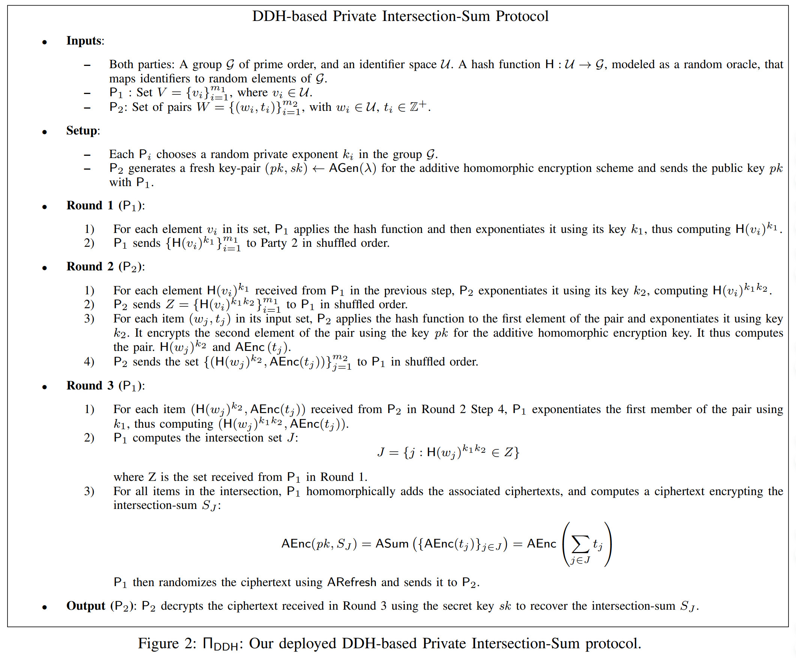

# DDH-based Private Intersection-Sum Protocol

本项目是基于**DDH假设**和**Paillier同态加密**实现的隐私保护交集求和（Private Intersection-Sum）协议。该协议允许两个参与方（P1和P2）在不泄露各自私有数据的前提下，安全地计算出他们数据集交集所对应数值的总和。

---

## 1. 背景介绍 (Background)

在许多现实场景中，两个或多个组织希望合作计算，但由于数据隐私和安全法规的限制，不能直接共享原始数据。例如：

- **广告效果分析**：广告商（P1）拥有投放广告的用户列表，而电商平台（P2）拥有在其平台完成购买的用户列表及其消费金额。双方希望计算那些既看了广告又完成购买的用户的总消费金额，以评估广告转化率，但双方都不愿意泄露各自的用户列表。
- **金融风控**：两家银行希望找出共同的风险客户名单，并汇总他们的总风险敞口，但不能直接共享客户信息。
- **公共卫生**：医疗机构希望统计在特定区域内出现的多种症状重叠的病例数量，而不泄露具体的病人信息。

**私有交集求和**协议正是为解决此类问题而设计的，它能够在保护各方数据隐私的同时，完成对交集信息的聚合计算。

---

## 2. 协议原理 (Protocol Principles)

本协议的安全性主要依赖于两大密码学原语：

### a. DDH假设

DDH假设是现代密码学的基石之一。它指出，在一个素数阶循环群 $\mathcal{G}$ 中，给定 $g, g^a, g^b$（其中 $g$ 是生成元，$a,b$ 是随机指数），要区分 $g^{ab}$ 和一个随机的群元素 $g^c$ 在计算上是不可行的。

- **在本协议中的应用**：
  协议利用DDH假设来实现**私有集合交集（Private Set Intersection, PSI）**。P1和P2分别持有私钥 $k_1$ 和 $k_2$。对于任意一个标识符 $x$，P1可以计算 $H(x)^{k_1}$，P2可以计算 $H(x)^{k_2}$。通过交换信息，双方可以共同计算出 $H(x)^{k_1k_2}$。
  - 如果 $x$ 是双方的共同元素，P1和P2计算出的最终值都是 $H(x)^{k_1k_2}$，因此可以确认 $x$ 在交集中。
  - 如果 $x$ 不是共同元素，双方无法计算出相同的值，从而保护了非交集元素的隐私。
  - 由于DDH假设，任何一方都无法从 $H(x)^{k_1}$ 或 $H(x)^{k_2}$ 中推断出对方的私钥。

### b. Paillier同态加密

Paillier是一个**加法同态加密**方案，它具有以下优良特性：
- **加法同态性**：两个密文的和等于它们对应明文和的密文。即 `Enc(m1) * Enc(m2) = Enc(m1 + m2)`（乘法代表密文域的加法操作）。
- **语义安全**：每次加密都会引入随机性，即使多次加密相同的明文，得到的密文也不同。

- **在本协议中的应用**：
  P2使用Paillier公钥 `pk` 加密其私有数值 $t_j$ 得到 `AEnc(t_j)`。P1在找到交集后，可以直接对这些加密后的数值 `AEnc(t_j)` 进行同态求和，得到一个加密的总和 `AEnc(∑t_j)`。由于没有私钥 `sk`，P1无法解密任何中间值或最终的总和，从而保证了P2数值的隐私性。

---

## 3. 协议详细解析 (Detailed Protocol Breakdown)

协议严格按照下图所示流程执行，分为四个主要阶段：



- **输入 (Inputs)**
  - **P1**: 持有标识符集合 $V = \{v_i\}$。
  - **P2**: 持有标识符-数值对集合 $W = \{(w_j, t_j)\}$。

- **设置 (Setup)**
  - P1和P2各自生成一个随机私钥 $k_1$ 和 $k_2$。
  - P2生成Paillier密钥对 $(pk, sk)$。

- **Round 1 (P1 → P2)**
  1. P1对自己的每个标识符 $v_i$ 进行盲化处理：计算 $A_i = H(v_i)^{k_1}$。
  2. P1将所有盲化后的值 $\{A_i\}$ 乱序后发送给P2。这隐藏了原始标识符的顺序和值。

- **Round 2 (P2 → P1)**
  1. P2对从P1收到的每个 $A_i$ 进行二次盲化：计算 $Z_i = A_i^{k_2} = (H(v_i)^{k_1})^{k_2} = H(v_i)^{k_1k_2}$。这个集合 $Z$ 将作为P1的交集“验证集”。
  2. P2处理自己的数据：
     - 对每个标识符 $w_j$，计算盲化值 $H(w_j)^{k_2}$。
     - 对每个数值 $t_j$，用公钥 `pk` 加密得到 `AEnc(t_j)`。
  3. P2将集合 $Z$ 和集合 $C = \{(H(w_j)^{k_2}, \textsf{AEnc}(t_j))\}$ 乱序后一起发送给P1。

- **Round 3 (P1 → P2)**
  1. P1收到 $Z$ 和 $C$ 后，开始计算交集。对于 $C$ 中的每一对数据，P1用自己的私钥 $k_1$ 对第一部分进行计算：$(H(w_j)^{k_2})^{k_1} = H(w_j)^{k_1k_2}$。
  2. P1将上一步计算出的结果与集合 $Z$ 进行比对。如果该值存在于 $Z$ 中，说明 $w_j$ 是一个交集元素。
  3. P1将所有交集元素对应的加密数值 `AEnc(t_j)` 收集起来。
  4. 利用加法同态性，P1将这些加密数值相加，得到一个加密的总和 $S_J = \textsf{AEnc}(\sum_{j \in J} t_j)$。
  5. P1对结果进行随机化（ARefresh，简单实现是加上一个0的密文），然后发送给P2。

- **输出 (Output)**
  - P2收到加密的总和 $S_J$ 后，用自己的私钥 `sk` 解密，即可得到最终的交集求和结果 $\sum_{j \in J} t_j$。

---

## 4. 代码实现思路 (Code Implementation)

- **`shared_logic.py`**:
  - **目的**: 确保P1和P2使用完全一致的协议参数，避免因参数不匹配导致协议失败。
  - **实现**: 定义了共享的素数 `FIXED_PRIME`、通信端口 `PORT`、哈希函数 `hash_to_group` 和私钥生成函数 `generate_private_key`。这减少了代码冗余，提高了可维护性。

- **`p2.py` (服务端)**:
  - **角色**: 协议的发起方之一，监听P1的连接。
  - **实现**:
    1.  初始化：创建`socket`服务端，生成Paillier密钥对 $(pk, sk)$ 和私钥 $k_2$。
    2.  执行**Round 2**：等待并接收P1在Round 1发送的数据 $\{A_i\}$。计算并发送 $\{Z_i\}$ 和 $\{C_j\}$ 给P1。
    3.  执行**Output**：接收P1在Round 3发送的加密总和，并用私钥 `sk` 解密，打印最终结果。

- **`p1.py` (客户端)**:
  - **角色**: 协议的参与方，主动连接P2。
  - **实现**:
    1.  初始化：创建`socket`客户端，生成私钥 $k_1$。
    2.  执行**Round 1**：连接P2后，计算并发送 $\{A_i\}$。
    3.  执行**Round 3**：接收P2在Round 2发送的数据 $Z$ 和 $C$。通过计算 $H(w_j)^{k_1k_2}$ 并与 $Z$ 比较来找出交集。对交集对应的加密值进行同态求和，并将结果发回给P2。

- **数据传输**:
  - 使用 `socket` 库进行底层的TCP网络通信。
  - 使用 `pickle` 库来序列化和反序列化Python对象（如列表、元组、加密密钥等），使其能够方便地在网络上传输。

---

## 5. 运行与测试 (Running and Testing)

### a. 依赖
- `gmpy2`: 用于高性能大整数运算。
- `phe`: 用于Paillier同态加密。

```bash
pip install -r requirements.txt
```

### b. 运行步骤

**必须先启动P2（服务端），再启动P1（客户端）。**

**终端1 - 启动P2:**
```bash
# 激活虚拟环境 (如果需要)
source venv/bin/activate

# 运行P2
python p2.py
```
*预期输出: `P2: Waiting for P1...`*

**终端2 - 启动P1:**
```bash
# 激活虚拟环境 (如果需要)
source v-env/bin/activate

# 运行P1
python p1.py
```

### c. 预期结果

- **P1输出**:
  ```
  P1: Connected to P2
  P1: Sent 3 elements
  P1: Received Z(3), C(3), pk
  P1: Sent encrypted sum (intersection size: 2)
  ```
- **P2输出**:
  ```
  P2: Waiting for P1...
  P2: Connected with P1 from ('127.0.0.1', ...)
  P2: Received 3 elements
  P2: Sent Z(3), C(3), pk
  P2: Intersection sum = 400
  ```
  这与测试数据（交集为 "user1" 和 "user3"，对应值的和为 100 + 300 = 400）相符，证明协议执行正确。
